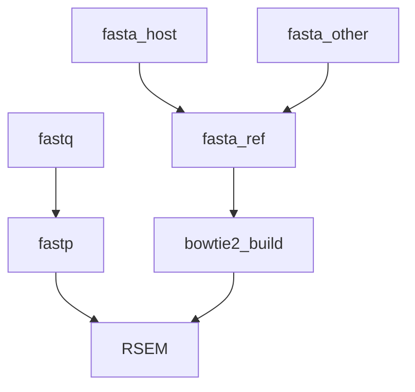

# Marine Omics RNASeq Pipeline

An RNASeq pipeline designed to accomodate both standard use-cases (ie single organism) as well as the case where both a host and partner (symbiont, parasite, commensal) are of interest. 



## Installation

First install and configure [nextflow](https://www.nextflow.io/). See [here](https://gist.github.com/iracooke/bec2b24a86eb682f7d3055eea15e61aa) for instructions specific to JCU machines (zodiac, genomics1, genomics2)

Run a test to make sure everything is working. This test should work on a system with singularity installed.

```bash
nextflow run marine-omics/morp -profile singularity,test_pe -r main
```

## Quick Start

As a minimum, `morp` requires a set of raw read data (fastq files) and a reference transcriptome. Assuming you have raw data paths in a file named `samples.csv` and a host reference transcriptome in the file `host.fasta` you would run an analysis with;

```bash
nextflow run marine-omics/morp -profile zodiac -r main --samples samples.csv --refa host.fasta
```

Note the profile here is `zodiac` which will load predefined settings for the JCU HPC. Other alternatives include `genomics` or a custom profile that you create yourself with `-c custom.config`.

If you would like to map reads against a dual transcriptome (eg host and symbiont) you can provide a second reference transcriptome like this

```bash
nextflow run marine-omics/morp -profile zodiac -r main --samples samples.csv --refa host.fasta --refb symbiont.fasta
```

In this case `morp` will start by combining transcripts from `refa` and `refb` into a single file.  The names of all transcripts in `refa` will be prepended with the prefix "a_" and those in `refb` will be prepended with "b_".  This will allow you to separate them out when you perform your statistical analysis. 

#### Raw Data (samples.csv)

The paths to fastq files must be provided in `csv` format as in the example below;

```
sample,fastq_1,fastq_2
1,sample1_r1.fastq.gz,sample1_r2.fastq.gz
2,sample2_r1.fastq.gz,sample2_r2.fastq.gz
```

See [here](https://gist.github.com/iracooke/bec2b24a86eb682f7d3055eea15e61aa#file-samples-md) for more detail on the samples.csv format. 


#### Reference sequences (`refa`, `refb`)

Reference sequences should be provided in `fasta` format. The first reference (`refa`) is always required, however the second `refb` need only be provided for dual organism studies and can be omitted in single-organism analysis. 

Note that both fasta files must be provided in uncompressed format (ie no `.gz`). Also note that all references provided should be transcripts not genomic sequences. This pipeline is not suitable for gapped alignment to a genome.

If you are working with coral sequences you might be unsure of the correct reference to use for `refb`.  A good place to start is to run the [moqc](https://github.com/marine-omics/moqc) pipeline which should give you an idea of the symbiont genus that is most dominant.  In the most common case this will be **Cladocopium** in which case a good choice for the reference sequence is the transcriptome available from [reefgenomics](http://symbs.reefgenomics.org/download/). 


#### Transcript to Gene Maps

The default analysis in `morp` assumes that every transcript is its own gene. To account for the fact that multiple isoforms can originate from the same gene you will need to provide a `transcript-to-gene-map` file for each reference. 

This file should conform to the requirements of `rsem-prepare-reference`. Each line should be of the form:

>gene_id transcript_id

with the two fields separated by a tab character.

Note that if you are performing a dual analysis (ie both `refa` and `refb` specified) and you provide a mapping file for one ref you must also provide it for the other.  Mapping files are provided with the `--refa_map` and `--refb_map` options. 


## Outputs

Successful completion of the pipeline will produce outputs in the `<outdir>` you provided including;

	- *multiqc* : Read mapping statistics . These statistics are produced by rsem based on Bowtie2 alignments.  
	- *rsem* : Full rsem outputs. This includes the aligned reads as `.bam` files as well as read counts in `isoforms.results` and `genes.results` files. 


The [tximport](https://bioconductor.org/packages/release/bioc/html/tximport.html) R package is recommended for importing `rsem` results into R for later analysis. 

The [rsem vignette](https://bioconductor.org/packages/release/bioc/vignettes/tximport/inst/doc/tximport.html#RSEM) provides specific advice on importing results at either the gene or isoform level. 

The example below shows importing results at the gene level. Unless you have an excellent isoform-level reference for your organism this is the recommended approach. 

```R
library(tximport)

genes_results_files <- list.files("morp_outputs/rsem/","*.genes.results",full.names = TRUE)

sample_names <- basename(genes_results_files) %>% str_extract("([^\\.])*")

names(genes_results_files) <- sample_names

txi.rsem <- tximport(genes_results_files, type = "rsem", txIn = FALSE, txOut = FALSE)
```

The resulting tximport object can then be used for analysis with [DESeq2](https://bioconductor.org/packages/release/bioc/html/DESeq2.html).  

When working with dual organism data the simplest approach is to keep data from both organisms together through the DESeq2 analysis.  Results can then be partitioned based on the gene id prefix `a_` or `b_`. 


