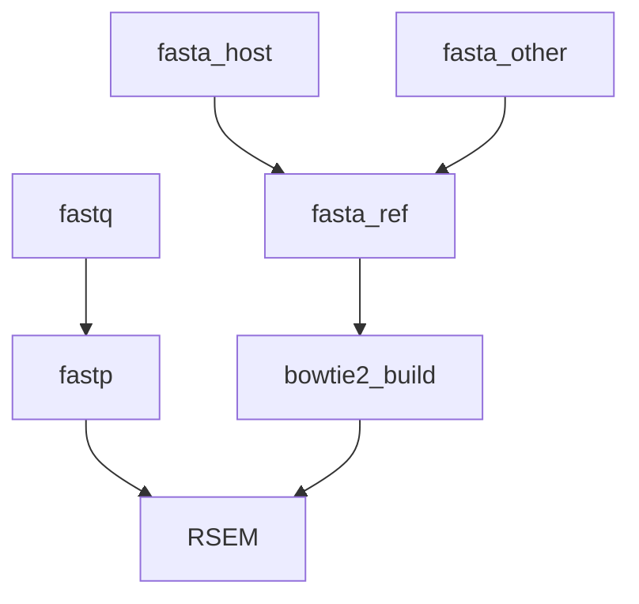

# Marine Omics RNASeq Pipeline

An RNASeq pipeline designed to accomodate both standard use-cases (ie single organism) as well as the case where both a host and partner (symbiont, parasite, commensal) are of interest. 

## Required inputs

References should be transcripts not genomic sequences. This pipeline is not suitable for gapped alignment to a genome.

- Host reference. This should be a host transcriptome
- Symbiont ref. Should also be a transcriptome